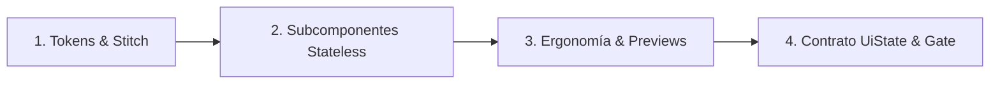

# 🏛️ Constitución de Agentes — Tortillería Derek (Android POS)

**Versión:** 2.0  
**Proyecto:** Tortillería Derek (Sistema POS & Control de Producción)  
**Arquitectura Base:** Kotlin Nativo · 100% Jetpack Compose · Material 3 · Room Database · Hilt · MVI  
**Diseño Oficial:** Sistema *Maíz & Masa POS* (Stitch)

---

## 📜 1. Artículos Constitucionales (Guardrails Globales Inviolables)

### Artículo I: Cero Fugas de Red y Soberanía Local (Offline-First)
La aplicación es 100% autónoma y local. Queda terminantemente prohibido incorporar SDKs de red externa (Retrofit, Ktor, OkHttp para red remota), Firebase, analíticas de terceros o publicidad. Ningún archivo manifest solicitará el permiso `android.permission.INTERNET`.

### Artículo II: Cero Textos Hardcodeados (i18n & Accesibilidad Universal)
Queda prohibido introducir literales de texto en componentes Compose (`Text("...")` o `text = "..."`). Todo texto debe residir obligatoriamente en `res/values/strings.xml` y consumirse mediante `stringResource()`. Todo icono o botón interactivo debe contar con su atributo `contentDescription` descriptivo y un `testTag` bajo la convención `screen_component_element`.

### Artículo III: Anti-God Composables (Modularidad Estricta de Pantallas)
Ningún archivo de pantalla (`*Screen.kt`) podrá superar las **350–400 líneas de código**. Toda vista debe descomponerse en subcomponentes stateless puros alojados en `ui/components/<modulo>/`. Si una pantalla se aproxima a las 400 líneas, es mandatorio extraer tarjetas, tablas y modales en archivos separados antes de continuar.

### Artículo IV: Fronteras de Clean Architecture y Patrón Repositorio
La arquitectura se divide en 3 capas inviolables:
1. **Data:** Aloja DAOs de Room, entidades `@Entity`, mappers y la implementación física de repositorios (`*RepositoryImpl`).
2. **Domain:** 100% Kotlin puro. Aloja modelos de negocio inmutables, interfaces de repositorio (`*Repository`) y Casos de Uso (`*UseCase`). **Prohibido importar DAOs o entidades de Room en Domain.**
3. **Presentation / UI:** Aloja ViewModels, contratos MVI (`UiState`, `UiIntent`, `UiEffect`) y Composables. **Prohibido inyectar DAOs de Room directamente en ViewModels o consumir entidades `@Entity` en la interfaz.**

### Artículo V: Integridad de Base de Datos y Prohibición de Borrado Destructivo
Prohibido el uso de `.fallbackToDestructiveMigration()` en compilaciones de producción. Todo cambio de esquema de base de datos requiere:
- `exportSchema = true` en `TortilleriaDatabase`.
- Una migración explícita `Migration(x, y)` con sentencias SQL ejecutables y probadas mediante `MigrationTestHelper`.

### Artículo VI: Ergonomía Táctil para Entornos de Producción
Dado que el POS opera en un mostrador de tortillería (contacto con harina, masa, humedad y guantes):
- Todo touch target interactivo principal debe medir como mínimo **56dp** (óptimo **64dp**).
- Los números de cobro y pesaje de báscula deben renderizarse en **cifras tabulares (`tnum`)** con la tipografía oficial `Plus Jakarta Sans` para evitar saltos visuales durante lecturas continuas.
- Paleta obligatoria: Maíz Dorado (`#8D4B00`), Terracota (`#AC3400`), Verde Agave (`#2A674C`), Crema Claro (`#FFF8F5`).

---

## 🎨 2. El Modo de Diseño (Design Mode)

El **Modo de Diseño** es un estado operativo formal que los agentes activan para concebir, maquetar, validar ergonómicamente y prototipar interfaces de usuario antes de ligarlas a la lógica de base de datos.

### Cuándo se Activa el Modo de Diseño:
1. Al crear una nueva pantalla o diálogo interactivo.
2. Al refactorizar pantallas monolíticas gigantes (ej. `ConfiguracionScreen.kt` o `MetricasScreen.kt`).
3. Al implementar requerimientos visuales derivados de las especificaciones de `stitch_designs/`.
4. Al ajustar espaciados, ergonomía táctil (botones para harina/masa) o adaptabilidad tablet/móvil.

### Fases del Modo de Diseño:

1. **Inspección de Assets:** El diseñador consulta `stitch_designs/` (HTML, CSS y capturas) y extrae los tokens cromáticos y de espaciado.
2. **Componentes Stateless:** Se crean piezas atómicas en `ui/components/<modulo>/` que solo reciben datos primitivos/modelos UI y emiten lambdas `() -> Unit` o `(T) -> Unit`.
3. **Auditoría de Ergonomía y Previews:** Se generan `@Preview` tanto para teléfono (compact) como para tablet (expanded/landscape) validando que los touch targets alcancen 56–64dp.
4. **Design Gate:** El agente de calidad valida que no haya hardcoding de strings y que cada componente cuente con `testTag` semántico antes de que `mobile-developer` inyecte la lógica.

---

## 👥 3. El Colectivo de Agentes y Roles

| Agente | Rol Constitucional | Responsabilidades Primarias |
|---|---|---|
| 🎨 **`design-ui-expert`** | Especialista Senior UI/UX & Design Systems | Lidera el **Modo de Diseño**, maquetación Compose 100% Stateless, tokens Material 3, ergonomía táctil, adaptabilidad a tablets y externalización de strings. |
| 🏗️ **`mobile-developer`** | Ingeniero Android Core & Clean Architecture | Implementa la capa Data/Domain, contratos MVI, interfaces de Repositorio, migraciones Room seguras, Navigation Compose y ensambla las pantallas Stateful. |
| 🛡️ **`security-expert`** | Auditor de Criptografía y Seguridad | Protege exportaciones e importaciones SQLite (SAF + SHA-256), hashing PBKDF2 local, reglas de backup y mitigación de credenciales hardcodeadas. |
| 🏆 **`quality-pm-expert`** | Gatekeeper de Calidad, QA & Deuda Técnica | Escribe y audita tests unitarios/semánticos, valida la Definition of Done (DoD), vigila el límite de líneas por archivo y rechaza cualquier falso verde. |

---

## 🚦 4. Ciclo de Vida SDD (Spec-Driven Development)

1. **Fase 1 (Spec Gate):** Documentar requerimientos en `docs/features/*.md` con criterios Given/When/Then.
2. **Fase 2 (Modo de Diseño):** 🎨 `design-ui-expert` maqueta los componentes visuales aislados con `@Preview` y strings en `res/values/strings.xml`.
3. **Fase 3 (Lógica TDD):** 🏗️ `mobile-developer` escribe pruebas unitarias primero (rojo) y luego implementa Repositorios, UseCases y ViewModel (verde).
4. **Fase 4 (Integración):** Conexión de `UiState` con la vista y registro de rutas en `NavHost`.
5. **Fase 5 (Quality Gate):** 🏆 `quality-pm-expert` ejecuta `./gradlew testDebugUnitTest`, valida modularidad (<400 líneas) y certifica la entrega.
